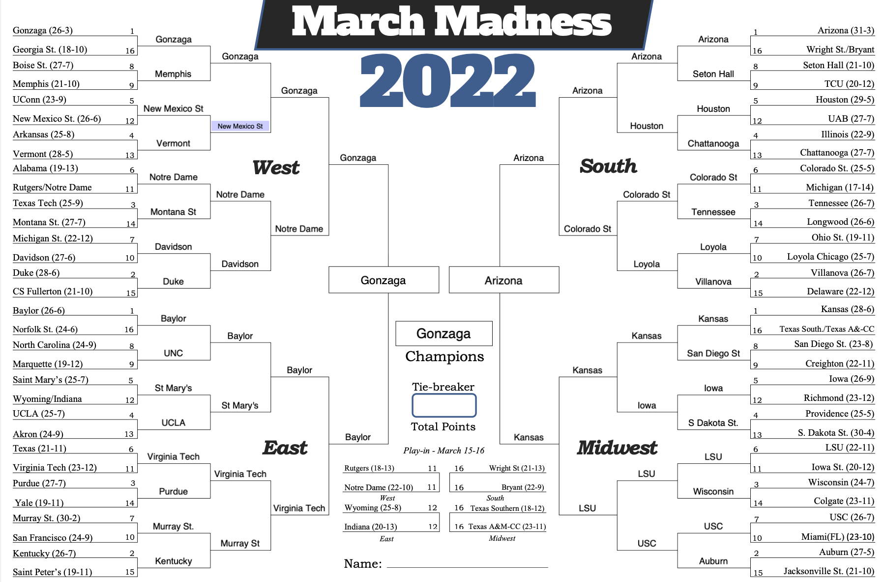

# march-ML-mania-22
Logistic Regression model to assign probabilities of outcomes for any possible matchup in the 2022 NCAA Men's Basketball Tournament for the March Machine Learning Mania 2022 - Men's competition on [Kaggle](https://www.kaggle.com/c/mens-march-mania-2022/).
This model takes the difference in each team's season-long average statistics as input and outputs a probability that one team will beat the other.

## Using the Model
The two scripts `statCompiler.py` and `resultCompiler.py` transform the data given by Kaggle into `all_reg_season_team_stats.csv` and `allResults.csv` respectively.
`all_reg_season_team_stats.csv` holds the average stats for each team in the dataset for each season they are included in the original dataset. `allResults.csv` holds the outcomes of each game played from 2003-2022.
  
`trainingDataCompiler.py` takes the compiled stats and results to create `training_data.csv` which holds the difference of average statistics for both teams in a matchup as well as the result.
  
`gamePredict.py` then predicts the outcomes of all possible matchups in the 2022 tournmanent with a logistic regression model trained with the data previously created. This results in `lr_output.csv` which is a list of all possible matchups along with a probability that the team with the lower ID will beat the team with the higher ID.
  
`round32.csv` was hand-made to show the predicted outcome from the round of 64. `outputDecoder.py` was used to transform the `lr_output.csv` to a human-readable format (replacing IDs with school names) for this process.
  
`bracketBuilder.py` takes the `round32.csv` results and predicts the rest of the bracket (see below).

## Room for Improvement
This project could have been improved on a few fronts
 - Start earlier. We started this project two days before the tournament began which gave us little time to prepare.
 - Find better data. We limited ourselves to the data provided by Kaggle and only used the regular season statistics as data points for each team. Things likes strength of schedule need to be taken into account because some teams do very well in the regular season but perform poorly in the tournament because their regular season opponents simply aren't as good as who they play in the tournament.
 - Feature transformation and selection. We dabbled with PCA transormation and simulated annealing in the 2003_classifier but this was ultimately never implemented in the final product. This could help improve our results.
 - Try other models. We stuck to the logistic regression model for this project but believe a neural network implementation may provide better results in the future.
